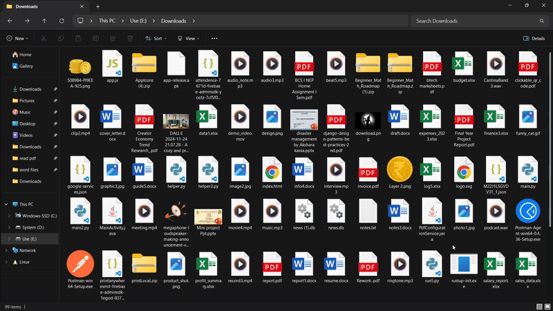

# 🗂️ Auto File Organizer

A smart, customizable file organization tool for your local directories. Sort files by **type**, **date**, or **filename patterns**, with full support for **undo**, **exceptions**, and intelligent folder cleanup.

---

### 🧪 In Action



---

## 🚀 Features

- 📁 **Sort by Type, Date, or Pattern**
- 🔁 **Undo** any sorting operation with one command
- ⚠️ **Ignore** specific files or patterns using wildcards or regex
- 🧠 **Folder cleanup** based on smart rules (no accidental user folder deletions)
- 🔒 Prevents accidental file overwrites
- 🛠️ Clean CLI interface

---

## 🔧 Installation

```bash
pip install auto-file-organizer
organize --help
```
## 🚧 Future Goals
🤖 LLM Integration (Under Construction)
We're working on integrating a Language Model to understand file names and intelligently suggest or auto-categorize files based on content/context. Stay tuned!

---
## 📦 PyPI

[](https://pypi.org/project/auto-file-organizer/)
